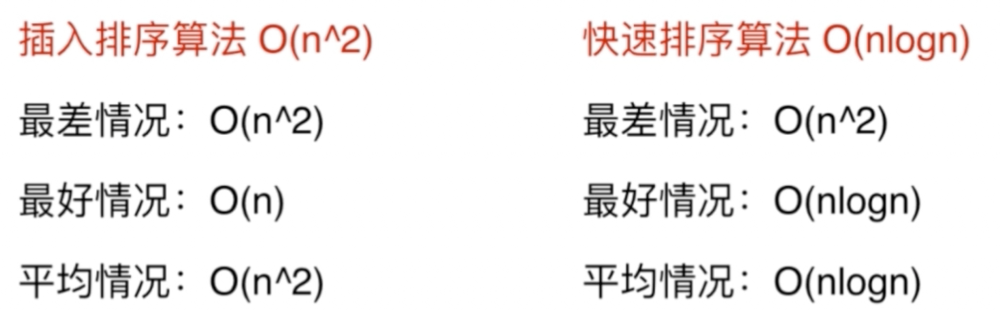

[TOC]

# 第1章 算法面试到底是什么鬼

## 面试官想要的答案未必是完全正确的

>面试未必答案要正确，但一定要思路清晰，沟通最好的答案！独到见解；优化；代码规范；容错性；
>
>大量重复
>
>三路快排：大量重复元素
>
>普通快排：所有元素都是独特的
>
>数据特性
>
>插入排序：近乎有序，银行业务处理
>
>计数排序：取值范围有序，比如考试成绩0-100
>
>额外要求
>
>归并：稳定排序不能选快排了
>
>数据存储
>
>归并：快排依赖数组的随机存取，假如此时数据是链表方式进行存取，快排就不适用了
>
>存储状况
>
>外排序：数据量大，内存小，不足以装在内存

## 算法面试优秀并不意味技术面试优秀

>项目经历实际解决问题（Coursera国外在线教育机构）课程设计、整理代码、博客github
>
>印象最深的bug
>
>常规：面向对象、设计模式、并发、网络、系统设计……

技术面试优秀不代表拿到offer

>过去经历考察思考行为方式 ，最好跟项目挂钩
>
>反问面试官：
>
>小组运营模式、项目中长期规划、产品中的某问题如何解决 、为啥选这个技术标准 、小组中怎样深入技术机会

## 准备面试 和 准备算法面试 是两个概念

>算法面试：
>
>不要过度将注意集中在算法推导，记住结论
>
>平均看，高级数据结构和算法面试提及概率低，了解概念 （红黑树、B-Tree、斐波那契堆、几何、数论、FFT）
>
>ACM等竞赛比不属于一个层面 
>
>准备范围：
>
>各种排序算法
>
>基础数据结构和算法的实现（堆、二叉树、图……）
>
>基础数据结构的使用（链表、栈、队列、哈希表、图、Trie、并查集……）
>
>基础算法（深度优先、广度优先、二分查找、递归……）
>
>基本算法思想（递归、分治、回溯搜索、贪心、动态规划……）
>
>选择合适的OJ Online Judge在线判题
>
>有些难度不推荐面试用： 俄罗斯、美国、印度（不要偏向竞赛的）
>
>
>
>推荐使用：力扣（真实面试题）、HackerRank（题目分类详细 偏难 为辅）

举例子

## 解决算法面试问题的整体思路

### 提取关键信息

>有序数组（二分查找法）
>
>暗示设计O(nLogn)算法（八成离不开分治，在一个搜索树中完成 、或者先对数据进行此复杂度排序后续On）
>
>无需开辟额外的空间（想是否要开辟空间换时间）
>
>数据规模大概是10000（设计O(n2)就可以解决，完全可以解决百万级或者千万级数据）

### 假设简单测试用例

>不要忽视暴力，这是思考的起点

###优化算法

> 直觉：
>
> 算法思路遍历
>
> 数据结构遍历
>
> 常规思路：
>
> 时间空间互换（哈希表）
>
> 预处理（排序）
>
> 瓶颈处找答案（影响复杂度最大的因素）

### 实际编写

>极端情况判断
>
>值为空
>
>变量名
>
>模块化、复用性

# 第2章 面试中的复杂度分析

## 什么是大O?

可忽略不计的常数和n组成的函数

直观比较，为什么常数项忽略。【算法用于数据规模大，如果规模小大O比较未必有绝对优势】

约定俗称的默认理解：

> 学术对大O取上界，比如归并O(n2)
>
> 业界大O取最低的下界，归并O(nlogn)

取值取数据规模影响大的O(nlogn+n)=O(nlogn) 

>所处理的规模n前提要是一样的
>
>如果n代表的是不一样的则不能省略 比如：对临界表实现图的遍历O(V,E),V是顶点个数，E是图边个数

算法复杂程度与用例相关，关注平均情况

## 对数据规模建立概念

# 第3章数组

## 题型分析

>暴力
>
>双指针
>
>三路快排
>
>最大堆
>
>快速排序
>
>双指针对撞
>
>滑动窗口

## 题目

1. [Leetcode真题分门别类讲解-3数组](https://github.com/bennyrhys/interview/commit/95b79e75a73761518e3315b45e340c78956d318a)

   

   [bennyrhys](https://github.com/bennyrhys/interview/commits?author=bennyrhys) committed 42 seconds ago

   [95b79e7](https://github.com/bennyrhys/interview/commit/95b79e75a73761518e3315b45e340c78956d318a)

    

2. [_76最小覆盖子串 滑动窗口](https://github.com/bennyrhys/interview/commit/a2dba4ca86037b573e998b82112e89d71aea21e3)

   

   [bennyrhys](https://github.com/bennyrhys/interview/commits?author=bennyrhys) committed 2 minutes ago

   [a2dba4c](https://github.com/bennyrhys/interview/commit/a2dba4ca86037b573e998b82112e89d71aea21e3)

    

Commits on Mar 16, 2020

1. [_438找到字符串中所有字母异位词-滑动窗口](https://github.com/bennyrhys/interview/commit/0927d13dee688dc2735ae72e4c5c7ae1d3944d11)

   

   [bennyrhys](https://github.com/bennyrhys/interview/commits?author=bennyrhys) committed 6 days ago

   [0927d13](https://github.com/bennyrhys/interview/commit/0927d13dee688dc2735ae72e4c5c7ae1d3944d11)

    

2. [_3无重复字符的最长子串-滑动窗口](https://github.com/bennyrhys/interview/commit/027aabec3106a1805733a59f5297974f3506f933)

   

   [bennyrhys](https://github.com/bennyrhys/interview/commits?author=bennyrhys) committed 6 days ago

   [027aabe](https://github.com/bennyrhys/interview/commit/027aabec3106a1805733a59f5297974f3506f933)

    

3. [_209长度最小的子数组-双指针滑动窗口](https://github.com/bennyrhys/interview/commit/2ae3fb3c77007c8adb4178602423216b29183edb)

   

   [bennyrhys](https://github.com/bennyrhys/interview/commits?author=bennyrhys) committed 6 days ago

   [2ae3fb3](https://github.com/bennyrhys/interview/commit/2ae3fb3c77007c8adb4178602423216b29183edb)

    

4. [_209长度最小的子数组-暴力优化求和版](https://github.com/bennyrhys/interview/commit/d7c1b263f716413479e4cdbff1e014c88cb23515)

   

   [bennyrhys](https://github.com/bennyrhys/interview/commits?author=bennyrhys) committed 6 days ago

   [d7c1b26](https://github.com/bennyrhys/interview/commit/d7c1b263f716413479e4cdbff1e014c88cb23515)

    

5. [_11盛最多水的容器-对撞指针](https://github.com/bennyrhys/interview/commit/a0580e0c4dcf2e7dec3da4e93462b563777decc0)

   

   [bennyrhys](https://github.com/bennyrhys/interview/commits?author=bennyrhys) committed 6 days ago

   [a0580e0](https://github.com/bennyrhys/interview/commit/a0580e0c4dcf2e7dec3da4e93462b563777decc0)

    

6. [___345反转字符串中的元音字母-对撞指针](https://github.com/bennyrhys/interview/commit/a4aec8218795afe7ca3f8e65043e1a0bf353d03f)

   

   [bennyrhys](https://github.com/bennyrhys/interview/commits?author=bennyrhys) committed 6 days ago

   [a4aec82](https://github.com/bennyrhys/interview/commit/a4aec8218795afe7ca3f8e65043e1a0bf353d03f)

    

7. [__344反转字符串-双指针对撞](https://github.com/bennyrhys/interview/commit/ca6bb19448dcaedd7523b90f791984a679df3394)

   

   [bennyrhys](https://github.com/bennyrhys/interview/commits?author=bennyrhys) committed 6 days ago

   [ca6bb19](https://github.com/bennyrhys/interview/commit/ca6bb19448dcaedd7523b90f791984a679df3394)

    

8. [_125验证回文串-双指针对撞](https://github.com/bennyrhys/interview/commit/2ea040fabadc88bc2a16cb2ba806fec606a56583)

   

   [bennyrhys](https://github.com/bennyrhys/interview/commits?author=bennyrhys) committed 6 days ago

   [2ea040f](https://github.com/bennyrhys/interview/commit/2ea040fabadc88bc2a16cb2ba806fec606a56583)

    

9. [_125验证回文串-库函数](https://github.com/bennyrhys/interview/commit/94c83d910dadcb4e4e03460d230090edec9bcc30)

   

   [bennyrhys](https://github.com/bennyrhys/interview/commits?author=bennyrhys) committed 6 days ago

   [94c83d9](https://github.com/bennyrhys/interview/commit/94c83d910dadcb4e4e03460d230090edec9bcc30)

    

10. [_167两数之和_输入有序数组-对撞指针，利用有序性](https://github.com/bennyrhys/interview/commit/d9e39f0e37ab240ba6d59725bb3c68c92064dfd5)

    

    [bennyrhys](https://github.com/bennyrhys/interview/commits?author=bennyrhys) committed 7 days ago

    [d9e39f0](https://github.com/bennyrhys/interview/commit/d9e39f0e37ab240ba6d59725bb3c68c92064dfd5)

     

11. [_167两数之和_输入有序数组-二分查找,有序](https://github.com/bennyrhys/interview/commit/6175f9381acb195d664488aeab215fe77b2a21d6)

    

    [bennyrhys](https://github.com/bennyrhys/interview/commits?author=bennyrhys) committed 7 days ago

    [6175f93](https://github.com/bennyrhys/interview/commit/6175f9381acb195d664488aeab215fe77b2a21d6)

     

Commits on Mar 15, 2020

1. [_167两数之和_输入有序数组-暴力,未用上有序](https://github.com/bennyrhys/interview/commit/a91709aaec3aeeb00b3187ebab1616c46edf120e)

   

   [bennyrhys](https://github.com/bennyrhys/interview/commits?author=bennyrhys) committed 7 days ago

   [a91709a](https://github.com/bennyrhys/interview/commit/a91709aaec3aeeb00b3187ebab1616c46edf120e)

    

2. [_167两数之和_输入有序数组-暴力,未用上有序](https://github.com/bennyrhys/interview/commit/52c8f7662c9065b9aec3a0b3db939b1a5b182880)

   

   [bennyrhys](https://github.com/bennyrhys/interview/commits?author=bennyrhys) committed 7 days ago

   [52c8f76](https://github.com/bennyrhys/interview/commit/52c8f7662c9065b9aec3a0b3db939b1a5b182880)

    

3. [_215数组中的第K个最大元素-快速选择](https://github.com/bennyrhys/interview/commit/c6a84fdc680c34057ced42f75088c5a066727760)

   

   [bennyrhys](https://github.com/bennyrhys/interview/commits?author=bennyrhys) committed 7 days ago

   [c6a84fd](https://github.com/bennyrhys/interview/commit/c6a84fdc680c34057ced42f75088c5a066727760)

    

4. [_215数组中的第K个最大元素-快速选择](https://github.com/bennyrhys/interview/commit/fbb7077dad68f94cca2f2afedb00c17ef52e2cfd)

   

   [bennyrhys](https://github.com/bennyrhys/interview/commits?author=bennyrhys) committed 7 days ago

   [fbb7077](https://github.com/bennyrhys/interview/commit/fbb7077dad68f94cca2f2afedb00c17ef52e2cfd)

    

5. [_215数组中的第K个最大元素-当数据不重复直接返回就行](https://github.com/bennyrhys/interview/commit/a7d62d31d9a28462f544c9c68c0f449d1f960c4f)

   

   [bennyrhys](https://github.com/bennyrhys/interview/commits?author=bennyrhys) committed 7 days ago

   [a7d62d3](https://github.com/bennyrhys/interview/commit/a7d62d31d9a28462f544c9c68c0f449d1f960c4f)

    

6. [_215数组中的第K个最大元素-最大堆](https://github.com/bennyrhys/interview/commit/3de8c0741f7a13c07d03e1d5a753b49490c9dc1c)

   

   [bennyrhys](https://github.com/bennyrhys/interview/commits?author=bennyrhys) committed 8 days ago

   [3de8c07](https://github.com/bennyrhys/interview/commit/3de8c0741f7a13c07d03e1d5a753b49490c9dc1c)

    

Commits on Mar 14, 2020

1. [_215数组中的第K个最大元素-库函数](https://github.com/bennyrhys/interview/commit/095a994249d532018c746eaa056c988965055037)

   

   [bennyrhys](https://github.com/bennyrhys/interview/commits?author=bennyrhys) committed 8 days ago

   [095a994](https://github.com/bennyrhys/interview/commit/095a994249d532018c746eaa056c988965055037)

    

2. [_88合并两个有序数组2-双指针](https://github.com/bennyrhys/interview/commit/8c61eec2530091086f0d27a8f713fedd55c5f42d)

   

   [bennyrhys](https://github.com/bennyrhys/interview/commits?author=bennyrhys) committed 8 days ago

   [8c61eec](https://github.com/bennyrhys/interview/commit/8c61eec2530091086f0d27a8f713fedd55c5f42d)

    

3. [_88合并两个有序数组2-双指针](https://github.com/bennyrhys/interview/commit/6c551b27f8be8ccdebf754932e3fd14be4a0140b)

   

   [bennyrhys](https://github.com/bennyrhys/interview/commits?author=bennyrhys) committed 8 days ago

   [6c551b2](https://github.com/bennyrhys/interview/commit/6c551b27f8be8ccdebf754932e3fd14be4a0140b)

    

4. [_88合并两个有序数组2-双指针](https://github.com/bennyrhys/interview/commit/9f65bdfd49b73982f72489acc1c2f5c970f865eb)

   

   [bennyrhys](https://github.com/bennyrhys/interview/commits?author=bennyrhys) committed 8 days ago

   [9f65bdf](https://github.com/bennyrhys/interview/commit/9f65bdfd49b73982f72489acc1c2f5c970f865eb)

    

5. [_88合并两个有序数组-库函数](https://github.com/bennyrhys/interview/commit/681fc31b8884350ba13fe27abef487b21f0d34e3)

   

   [bennyrhys](https://github.com/bennyrhys/interview/commits?author=bennyrhys) committed 8 days ago

   [681fc31](https://github.com/bennyrhys/interview/commit/681fc31b8884350ba13fe27abef487b21f0d34e3)

    

6. [_75颜色分类-三路快排](https://github.com/bennyrhys/interview/commit/719273e25fe1c7698db5e01dcd010fa2a4bcd4e8)

   

   [bennyrhys](https://github.com/bennyrhys/interview/commits?author=bennyrhys) committed 8 days ago

   [719273e](https://github.com/bennyrhys/interview/commit/719273e25fe1c7698db5e01dcd010fa2a4bcd4e8)

    

7. [_75颜色分类-三路快排](https://github.com/bennyrhys/interview/commit/91b22745b403a8483455d390d617317c9c952cab)

   

   [bennyrhys](https://github.com/bennyrhys/interview/commits?author=bennyrhys) committed 8 days ago

   [91b2274](https://github.com/bennyrhys/interview/commit/91b22745b403a8483455d390d617317c9c952cab)

    

8. [_75颜色分类](https://github.com/bennyrhys/interview/commit/4ae3842b048776762ba2ebbc13ce1450a4212cc3)

   

   [bennyrhys](https://github.com/bennyrhys/interview/commits?author=bennyrhys) committed 8 days ago

   [4ae3842](https://github.com/bennyrhys/interview/commit/4ae3842b048776762ba2ebbc13ce1450a4212cc3)

    

9. [_80删除排序数组中的重复项II](https://github.com/bennyrhys/interview/commit/702b5ecacf5c49357b1454af31632ad0a4cdce39)

   

   [bennyrhys](https://github.com/bennyrhys/interview/commits?author=bennyrhys) committed 9 days ago

   [702b5ec](https://github.com/bennyrhys/interview/commit/702b5ecacf5c49357b1454af31632ad0a4cdce39)

    

10. [_80删除排序数组中的重复项II](https://github.com/bennyrhys/interview/commit/06d6d56139c8356abf8f0b3969e3ed80fa798d03)

    

    [bennyrhys](https://github.com/bennyrhys/interview/commits?author=bennyrhys) committed 9 days ago

    [06d6d56](https://github.com/bennyrhys/interview/commit/06d6d56139c8356abf8f0b3969e3ed80fa798d03)

     

Commits on Mar 13, 2020

1. [_80删除排序数组中的重复项II](https://github.com/bennyrhys/interview/commit/380d8e428e1cd549c6100ccf8428990b8f6c09dc)

   

   [bennyrhys](https://github.com/bennyrhys/interview/commits?author=bennyrhys) committed 9 days ago

   [380d8e4](https://github.com/bennyrhys/interview/commit/380d8e428e1cd549c6100ccf8428990b8f6c09dc)

    

Commits on Mar 12, 2020

1. [Leetcode.数组._26删除排序数组中的重复项](https://github.com/bennyrhys/interview/commit/23e2ccba98298d4dd948302632da4b24a1dbeceb)

   

   [bennyrhys](https://github.com/bennyrhys/interview/commits?author=bennyrhys) committed 10 days ago

   [23e2ccb](https://github.com/bennyrhys/interview/commit/23e2ccba98298d4dd948302632da4b24a1dbeceb)

    

2. [Leetcode.数组.27移除元素-简化代码双指针](https://github.com/bennyrhys/interview/commit/107e67bd04408314f4de2de42c90013839d569f0)

   

   [bennyrhys](https://github.com/bennyrhys/interview/commits?author=bennyrhys) committed 10 days ago

   [107e67b](https://github.com/bennyrhys/interview/commit/107e67bd04408314f4de2de42c90013839d569f0)

    

3. [Leetcode.数组.27移除元素](https://github.com/bennyrhys/interview/commit/5adda75a73ab7834a45609c127318606ed3bb790)

   

   [bennyrhys](https://github.com/bennyrhys/interview/commits?author=bennyrhys) committed 10 days ago

   [5adda75](https://github.com/bennyrhys/interview/commit/5adda75a73ab7834a45609c127318606ed3bb790)

    

4. [Leetcode.数组.283移动零-交换](https://github.com/bennyrhys/interview/commit/a67ff428ab6e3825d3cc40843ddf13d578acc594)

   

   [bennyrhys](https://github.com/bennyrhys/interview/commits?author=bennyrhys) committed 10 days ago

   [a67ff42](https://github.com/bennyrhys/interview/commit/a67ff428ab6e3825d3cc40843ddf13d578acc594)

    

5. [Leetcode.数组.283移动零-优化空间](https://github.com/bennyrhys/interview/commit/1bdd3fabaa250da6252583c6a78dbecfaa21b5fe)

   

   [bennyrhys](https://github.com/bennyrhys/interview/commits?author=bennyrhys) committed 10 days ago

# 第4章 查找表相关问题

##  题目分析

> 查找有无Set
>
> 查找对应关系Map
>
> 共同特点：键不允许重复
>
> 注意有序性，配合二分是否可以优化？

## 题目

## 底层实现导致，复杂度不固定

> 比如
>
> HashMap1.7-1.8区别
>
> 数组+链表->+红黑树
>
> Hash导致失去顺序性

