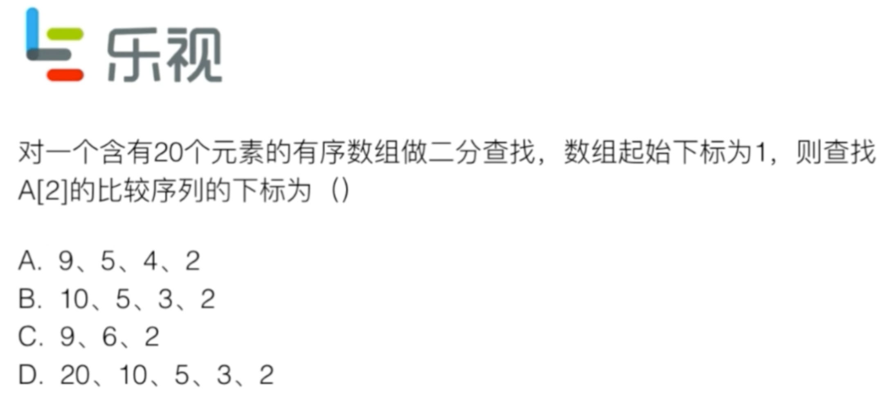

[TOC]

# 第1章 算法面试到底是什么鬼

## 面试官想要的答案未必是完全正确的

>面试未必答案要正确，但一定要思路清晰，沟通最好的答案！独到见解；优化；代码规范；容错性；
>
>大量重复
>
>三路快排：大量重复元素
>
>普通快排：所有元素都是独特的
>
>数据特性
>
>插入排序：近乎有序，银行业务处理
>
>计数排序：取值范围有序，比如考试成绩0-100
>
>额外要求
>
>归并：稳定排序不能选快排了
>
>数据存储
>
>归并：快排依赖数组的随机存取，假如此时数据是链表方式进行存取，快排就不适用了
>
>存储状况
>
>外排序：数据量大，内存小，不足以装在内存

## 算法面试优秀并不意味技术面试优秀

>项目经历实际解决问题（Coursera国外在线教育机构）课程设计、整理代码、博客github
>
>印象最深的bug
>
>常规：面向对象、设计模式、并发、网络、系统设计……

技术面试优秀不代表拿到offer

>过去经历考察思考行为方式 ，最好跟项目挂钩
>
>反问面试官：
>
>小组运营模式、项目中长期规划、产品中的某问题如何解决 、为啥选这个技术标准 、小组中怎样深入技术机会

## 准备面试 和 准备算法面试 是两个概念

>算法面试：
>
>不要过度将注意集中在算法推导，记住结论
>
>平均看，高级数据结构和算法面试提及概率低，了解概念 （红黑树、B-Tree、斐波那契堆、几何、数论、FFT）
>
>ACM等竞赛比不属于一个层面 
>
>准备范围：
>
>各种排序算法
>
>基础数据结构和算法的实现（堆、二叉树、图……）
>
>基础数据结构的使用（链表、栈、队列、哈希表、图、Trie、并查集……）
>
>基础算法（深度优先、广度优先、二分查找、递归……）
>
>基本算法思想（递归、分治、回溯搜索、贪心、动态规划……）
>
>选择合适的OJ Online Judge在线判题
>
>有些难度不推荐面试用： 俄罗斯、美国、印度（不要偏向竞赛的）
>
>
>
>推荐使用：力扣（真实面试题）、HackerRank（题目分类详细 偏难 为辅）

举例子

## 解决算法面试问题的整体思路

### 提取关键信息

>有序数组（二分查找法）
>
>暗示设计O(nLogn)算法（八成离不开分治，在一个搜索树中完成 、或者先对数据进行此复杂度排序后续On）
>
>无需开辟额外的空间（想是否要开辟空间换时间）
>
>数据规模大概是10000（设计O(n2)就可以解决，完全可以解决百万级或者千万级数据）

### 假设简单测试用例

>不要忽视暴力，这是思考的起点

###优化算法

> 直觉：
>
> 算法思路遍历
>
> 数据结构遍历
>
> 常规思路：
>
> 时间空间互换（哈希表）
>
> 预处理（排序）
>
> 瓶颈处找答案（影响复杂度最大的因素）

### 实际编写

>极端情况判断
>
>值为空
>
>变量名
>
>模块化、复用性

# 第2章 面试中的复杂度分析

## 什么是大O?

可忽略不计的常数和n组成的函数

直观比较，为什么常数项忽略。【算法用于数据规模大，如果规模小大O比较未必有绝对优势】

约定俗称的默认理解：

> 学术对大O取上界，比如归并O(n2)
>
> 业界大O取最低的下界，归并O(nlogn)

取值取数据规模影响大的O(nlogn+n)=O(nlogn) 

>所处理的规模n前提要是一样的
>
>如果n代表的是不一样的则不能省略 比如：对临界表实现图的遍历O(V,E),V是顶点个数，E是图边个数

算法复杂程度与用例相关，关注平均情况

## 对数据规模建立概念

