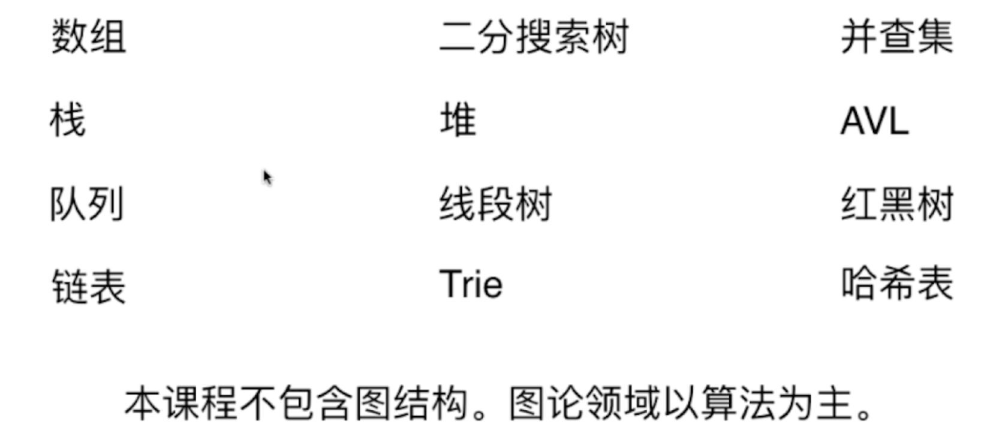
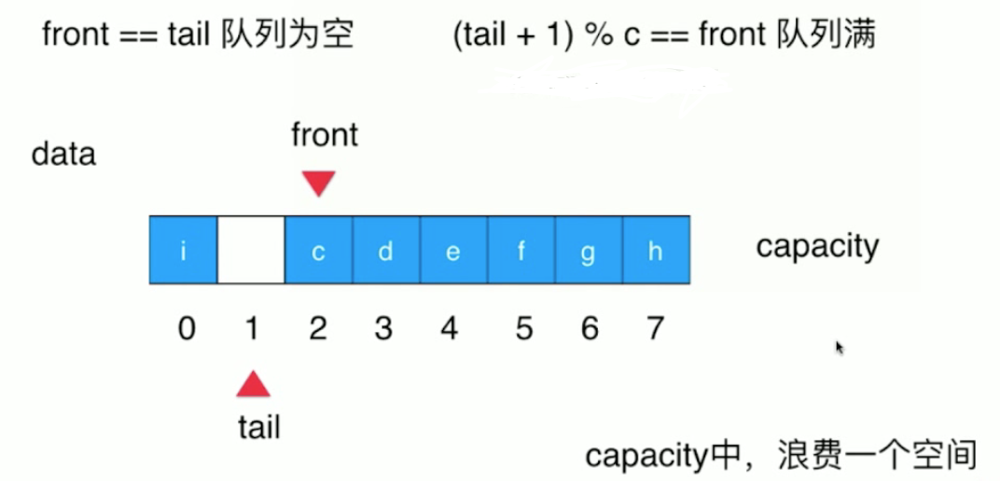
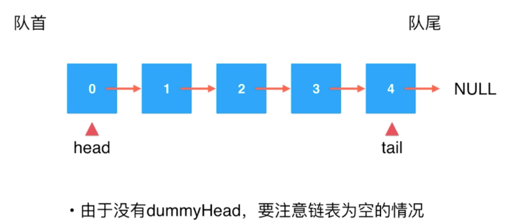

[toc]

# 第1章  欢迎学习《玩转数据结构》


>分类竖着数
>
>1-6面向面试
>
>7-9竞赛部分
>
> 10-12复杂数据结构



# 第2章 不要小瞧数组

注意

>自定义数组数据结构-基本函数功能
>
>泛型不能是基本数据类型（但是有包装类），只能是类对象
>
>动态数组扩容缩减

复杂度分析

>均摊复杂度衡量方法（最坏情况不会频繁被触发，经过分析也许会是常数阶）
>
>防止复杂度震荡（动态数组扩容缩减，不能设定同一种标准，lazy方案会缓解）

# 第3章 栈和队列

**栈**

>入栈、出栈、判空、获取栈顶、计数

应用场景

>IDE撤销
>
>系统调用
>
>括号匹配

**队列**

>入队列、出队列、判空、获取队首元素、计数

循环队列：解决出队O(n)

>front指向队首
>
>tail指向队尾的下一个位置



# 第4章  最基础的动态数据结构：链表

>最简单动态数据结构
>
>深入理解指针、递归
>
>辅助高级数据结构
>
>栈和队列也可以用链表实现
>
>优点：真正动态，不需要固定容量
>
>缺点：丧失随机访问能力
>
>链表：增删改查都是O(n),但是对于链表头节点相关操作是O(1)


>链表实现栈：既然对于链表头的操作是O(1)：通过栈解决链表的O(n)情况 
>
>【放在栈包下，方便比较**数组栈**、**链表栈**效率】


>链表实现队列：
>
>链表在==尾部添加tail==（不是复用），增加元素容易，删除元素不容易。因此**链表尾部是队尾**
>
>在队列里写，并比较时间



# 第5章  链表和递归

移除链表元素

```java
/**
 * 思考：通过删除之前的节点删除指定节点。
 *
 * 头节点没有之前的节点
 * 两种处理：
 * 1、特殊处理头
 * 2、虚拟头节点
 */

// 构建本地测试用例，提供可以本地调试的环境，创建ListNode中构造函数构建链表
```

体验递归乐趣

>手写数组加和

